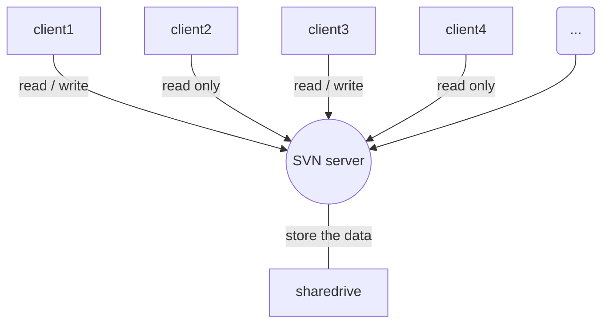
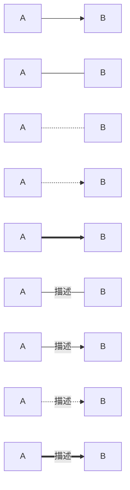
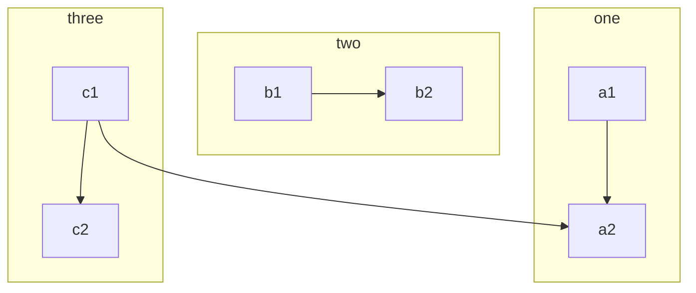
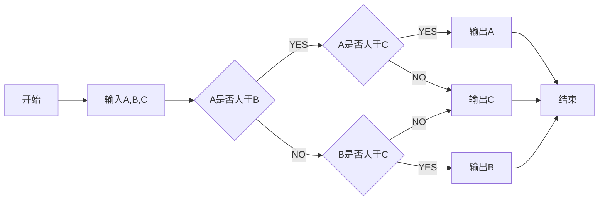

# Phalcon Framework

[](https://travis-ci.org/phalcon/cphalcon)
[](https://ci.appveyor.com/project/sergeyklay/cphalcon/branch/master)
[](https://github.com/phalcon/cphalcon/blob/master/BACKERS.md)
[](#backers)
[](#sponsors)

Phalcon is an open source web framework delivered as a C extension for the PHP language providing high performance and lower resource consumption.

A big thank you to [our Backers](https://github.com/phalcon/cphalcon/blob/master/BACKERS.md); you rock!

## Contents

- [Get Started](#get-started)
  - [Windows](#windows)
  - [Linux/Unix/Mac](#linuxunixmac)
    - [Requirements](#requirements)
      - [Ubuntu](#ubuntu)
      - [Suse](#suse)
      - [CentOS/Fedora/RHEL](#centosfedorarhel)
      - [macOS(Sierra / El Capitan / Yosemite)](#macossierra--el-capitan--yosemite)
  - [OSX MAMP ready extensions](#osx-mamp-ready-extensions)
  - [Gentoo](#gentoo)
  - [Compilation](#compilation)
  - [Contributing](#contributing)
  - [External Links](#external-links)
  - [Meet the Incubator](#meet-the-incubator)
  - [Sponsors](#sponsors)
  - [Backers](#backers)
  - [License](#license)

## Get Started

Phalcon is written in [Zephir/C](https://zephir-lang.com/) with platform independence in mind.
As a result, Phalcon is available on Microsoft Windows, GNU/Linux, FreeBSD and MacOS.
You can either download a binary package for the system of your choice or build it from source.

### Windows

To install Phalcon on Windows:

1. Download [Phalcon for Windows](https://phalconphp.com/en/download/windows)
2. Extract the DLL file and copy it to your PHP extensions directory
3. Edit your **php.ini** file and add this line:
   ```ini
   extension=php_phalcon.dll
   ```
4. Finally, restart your web server

**Hint:** To ensure that your Phalcon installation was successful, debug with
```php
<?php phpinfo(); ?>
```
and search for a section mentioning the Phalcon extension.

### Linux/Unix/Mac

On a Unix-based platform you can easily compile and install the extension from sources.

#### Requirements

Prerequisite packages are:

* PHP 5.5.x/5.6.x/7.0.x/7.1.x/7.2.x development resources (PHP 5.3 and 5.4 are no longer supported)
* `g++` >= 4.4 | `clang++` >= 3.x | `vc++` >= 11
* GNU `make` >= 3.81
* [`re2c`](http://re2c.org) >= 0.13

NOTE: Support for PHP 5.x is provided on a best-effort basis and will be removed in near future.

##### Ubuntu

```bash
# Use actual PHP development headers and tools here
sudo apt-get install php5-dev libpcre3-dev gcc make re2c
```

##### Suse

```bash
# Use actual PHP development headers and tools here
sudo zypper install php5-devel gcc make re2c
```

##### CentOS/Fedora/RHEL

```bash
# Use actual PHP development headers and tools here
sudo yum install php-devel pcre-devel gcc make re2c
```

##### macOS(Sierra / El Capitan / Yosemite)

Using [Homebrew](https://brew.sh/)

```bash
# brew install php<version>-phalcon
# available versions 56, 70, 71

brew install php71-phalcon
```

## OSX MAMP ready extensions

https://github.com/majksner/php-phalcon-mamp

## Gentoo

There is Gentoo ebuilds maintained for the Phalcon Framework: https://github.com/smoke/phalcon-gentoo-overlay

## Compilation

Follow these instructions to generate a binary extension for your platform:

```bash
git clone git://github.com/phalcon/cphalcon.git
cd cphalcon/build
sudo ./install
```

If you have specific php versions running

```bash
git clone https://github.com/phalcon/cphalcon
cd cphalcon/build
sudo ./install --phpize /usr/bin/phpize5.6 --php-config /usr/bin/php-config5.6
```

Add the extension to your **php.ini**:

```ini
extension=phalcon.so
```

Finally, **restart the web server**.

## Contributing

See [CONTRIBUTING.md](CONTRIBUTING.md) for details.

## External Links

* [Documentation](https://docs.phalconphp.com/)
* [Support](https://forum.phalconphp.com)
* [Zephir](https://zephir-lang.com/)
* [Twitter](https://twitter.com/phalconphp)

## Meet the Incubator

Our community is developing amazing extra features for Phalcon every day via [Incubator](https://github.com/phalcon/incubator).
There are resources to enhance your experience with the framework and that enlarge the main features.

Just give it a try and help us improve Phalcon even more!

## Sponsors

Become a sponsor and get your logo on our README on Github with a link to your site. [[Become a sponsor](https://opencollective.com/phalcon#sponsor)]

<a href="https://opencollective.com/phalcon/#contributors">

</a>

## Backers

Support us with a monthly donation and help us continue our activities. [[Become a backer](https://opencollective.com/phalcon#backer)]

<a href="https://opencollective.com/phalcon/#contributors">

</a>

## License

Phalcon is open source software licensed under the BSD 3-Clause License.
Copyright © 2011-present, Phalcon Team.<br>
See the [LICENSE.txt](https://github.com/phalcon/cphalcon/blob/master/LICENSE.txt) file for more.


shixu

```sequence
participant 客户端API
participant [RPC MQ]
participant 守护进程(处理逻辑)
participant [CALLBACK MQ]

客户端API->[RPC MQ]: 请求 服务消息 
[RPC MQ]-->>守护进程(处理逻辑): 监听获取 服务消息 
守护进程(处理逻辑)->[CALLBACK MQ]: 发送 回调消息 
[CALLBACK MQ]-->>客户端API: 监听获取 回调消息
客户端API-->>客户端API: ok得到返回结果
```


```sequence
participant A
participant B
participant C
A->B: 同步请求方法(主动)
B-->>C: 异步返回请求
Note left of A: 这边啦！
C-->>A: 异步返回Success
Note Right Of A: 那边啦！
```


liucheng

```flow
st=>start: 开始
op=>operation: 操作1
cond=>condition: 操作成功?
e=>end: 结束

st->op->cond
cond(yes)->e
cond(no)->op
```

```flow
st=>start: Start|past:>http://www.google.com[blank]
e=>end: End:>http://www.google.com
op1=>operation: My Operation|past
op2=>operation: Stuff|current
sub1=>subroutine: My Subroutine|invalid
cond=>condition: Yes 
or No?|approved:>http://www.baidu.com
c2=>condition: Good idea|rejected
io=>inputoutput: catch something...|request

st->op1(right)->cond
cond(yes, right)->c2
cond(no)->sub1(left)->op1
c2(yes)->io->e
c2(no)->op2->e

```


gantt

```gan
title A Gantt Diagram
    dateFormat  YYYY-MM-DD
    section Section
    A task           :a1, 2014-01-01, 30d
    Another task     :after a1  , 20d
    section Another
    Task in sec      :2014-01-12  , 12d
    another task      : 24d
```


what?













TODO List

```markdown
- [ ] **小专栏 Markdown 编辑器开发**

    - [ ] 增加 TOC 语法

    - [ ] 增加流程图、序列图、甘特图、Todo 列表

    - [x] 新增Todo列表功能 [语法参考](https://github.com/blog/1375-task-lists-in-gfm-issues-pulls-comments)

    - [x] 改进 LaTex 功能

        - [x] 修复 LaTex 公式渲染问题

        - [x] 新增 LaTex 公式编号功能 [语法参考](http://docs.mathjax.org/en/latest/tex.html#tex-eq-numbers)

- [ ] **最近小专栏推广**

    - [x] 唐巧微信公众号广告投放

    - [ ] 二月份小专栏微信服务号文章准备

    - [ ] 邀请更多技术牛人到小专栏写作
```


